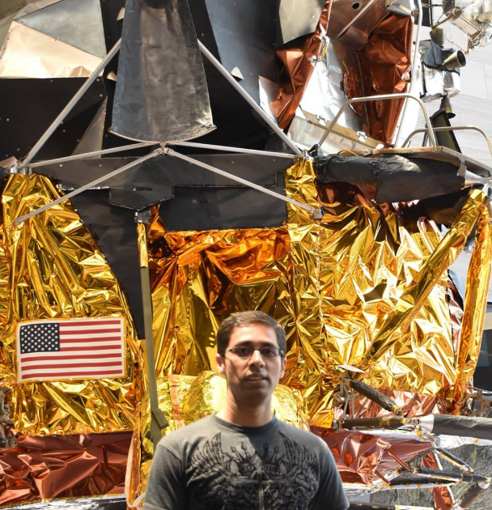
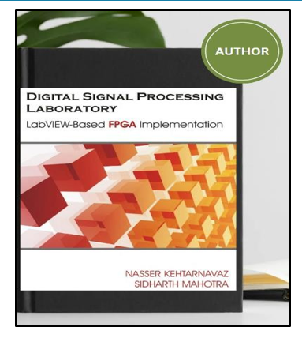
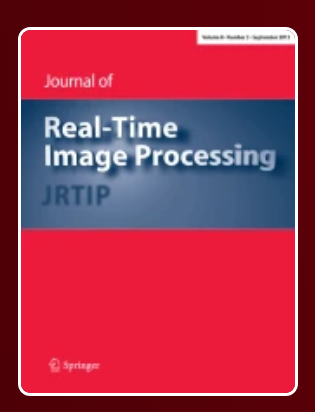

# Portfolio

|  |
# About Me
# Hi all,  **I go by Sid**.
- 🚀 Innovation @ AI, Computer Vision, Data Science, and Signal Processing  
- 🚀 Solving complex healthcare and tech challenges  
- 🚀 Proven leader delivering impactful solutions and mentoring teams to success

# Resume Link
[Download My Resume](https://drive.google.com/file/d/1WME7KWji7VekexhDrhlTokt-UJ9XAbfn/view?usp=drive_link)

## Achievements And Certifications 🏆

*Achievements, Awards, and Cool Stuff that I have done!*

| Achievement                                                                                  | Achievement                                                                                  | Award                                                                                  | Award                                                                                  |
|---------------------------------------------------------------------------------------------|---------------------------------------------------------------------------------------------|---------------------------------------------------------------------------------------------|---------------------------------------------------------------------------------------------|
|    **Author**   First Graduate-level book to implement DSP on FPGA using no textual code.   [Link to Book](https://www.amazon.com/Digital-Signal-Processing-Laboratory-Implementation/dp/1599425505) |    **Reviewer**   Reviewer for Real-Time Image Processing papers.   [Journal Link](https://link.springer.com/journal/11554) |    **National Interest Waiver I-140**   My work over the years acknowledged as of substantial intrinsic merit for national interest of the US.   [NIW: What is it](https://www.uscis.gov/newsroom/alerts/uscis-updates-guidance-on-eb-2-national-interest-waiver-petitions) |    **IEEE Senior Member**   Elevation to the grade of IEEE Senior Member.   [IEEE](https://www.ieee.org/membership/senior/) |

## Skills
*Jack of all trades, Master of some*
- ⚡ **Develop cutting-edge Computer Vision and Machine Learning solutions** tailored for businesses, focusing on real-world applications such as predictive analytics, automation, and customer insights.
- ✍️ **Write compelling articles and technical blogs on AI, technology trends, and innovation** to educate and inspire audiences.
- 🎨 **Design intuitive visualizations/dashboards** that merge functionality with aesthetics, ensuring seamless user experiences.
- 🚀 **Lead cross-functional teams to deliver impactful projects on time and within scope.**
- 🚀 **Mentor/Coach to navigate the difficult job market and more.**

## Software Skills

- **Programming Languages**
  - C/C++
  - Python
  - Matlab
  - SQL

- **Machine Learning Frameworks**
  - Keras
  - TensorFlow
  - PyTorch

- **Cloud Platforms**
  - GCP (Google Cloud Platform)
  - AWS (Amazon Web Services)
    
#Work Projects
Computer vision/Image Processing/ML
   = Image classification

## Work Experience Timeline

*Visualizing my professional journey through key milestones.*

|  |
|---------------------------------------------------|

## Notable Projects

*Notable companies that I helped to build innovative technology foundations from concept.*

| Project                                                                                     | Project                                                                                     | Project                                                                                     |
|---------------------------------------------------------------------------------------------|---------------------------------------------------------------------------------------------|---------------------------------------------------------------------------------------------|
|    **Medtronic**   Automated feature normalization, slashing manual optimization from 3 days to hours via custom pipeline implementation.   [Visit Website](https://www.medtronic.com/en-us/index.html) |    **Indian Space Research Organization (ISRO)**   Engineered MTF algorithm, blind deconvolution & wavelet denoising for high PSNR gain in Cartosat-2 satellite imagery.   [Visit Website](https://www.isro.gov.in/) |    **Synaptics Audio (Now Google)**   Developed earbud in/out detection algorithm with hybrid ANC/ENC and AI/neural processing, boosting efficiency, cutting size/cost for enhanced audio.   [Visit Website](https://www.synaptics.com/) |
|    **Zounds Hearing**   Spearheaded first patient-centric tinnitus diagnostic tool with GUI integration for hearing aid platforms.   [Visit Website](https://www.zoundshearing.com/) |                                                                                             |                                                                                             |

## Education

- **University of Texas at Dallas**  
   
  *Master of Science in Electrical Engineering*  
  **Duration:** September 2008 - May 2011  
  **Description:**  
  - Research on Signal Processing, Machine Learning, and Computer Vision
 

     
## Blogs

*Fueled by technical curiosity, I design engaging resources to teach others what I have learned.*

| Blog Title                                                                                                   | Blog Title                                                                                                   | Blog Title                                                                                                   |
|-------------------------------------------------------------------------------------------------------------|-------------------------------------------------------------------------------------------------------------|-------------------------------------------------------------------------------------------------------------|
| [Understanding Class Imbalance in Real-World Applications](https://www.linkedin.com/pulse/understanding-class-imbalance-real-world-applications-mahotra-gsbic/?trackingId=usKMxo6LRRuKTT5txW5HPA%3D%3D) | [Understanding Sensitivity vs Specificity: From Medical Diagnostics to Drug Discovery](https://www.linkedin.com/pulse/understanding-sensitivity-vs-specificity-from-medical-mahotra-zzs4c/?trackingId=usKMxo6LRRuKTT5txW5HPA%3D%3D) | [Yolo8 to Yolo11: A Comprehensive Review](https://www.linkedin.com/posts/sidharthmahotra_yolo-objectdetection-computervision-activity-7288768997121040384-17Gd?utm_source=share&utm_medium=member_desktop&rcm=ACoAAAIkL5EBU6d36PL5IUa1VNn6LBTPnzGJL88) |
| [Read Blog](https://www.linkedin.com/pulse/understanding-class-imbalance-real-world-applications-mahotra-gsbic/?trackingId=usKMxo6LRRuKTT5txW5HPA%3D%3D) | [Read Blog](https://www.linkedin.com/pulse/understanding-sensitivity-vs-specificity-from-medical-mahotra-zzs4c/?trackingId=usKMxo6LRRuKTT5txW5HPA%3D%3D) | [Read Blog](https://www.linkedin.com/posts/sidharthmahotra_yolo-objectdetection-computervision-activity-7288768997121040384-17Gd?utm_source=share&utm_medium=member_desktop&rcm=ACoAAAIkL5EBU6d36PL5IUa1VNn6LBTPnzGJL88) |
| [Addressing AI Explainability Challenges](https://www.linkedin.com/posts/sidharthmahotra_ai-explainability-challenges-activity-7286605939317653504-f0OP?utm_source=share&utm_medium=member_desktop&rcm=ACoAAAIkL5EBU6d36PL5IUa1VNn6LBTPnzGJL88) | [LLM Pre/Post Training State of the Art -2024](https://www.linkedin.com/posts/sidharthmahotra_llm-pre-and-post-training-insights-activity-7280816853394845700-Nd40?utm_source=share&utm_medium=member_desktop&rcm=ACoAAAIkL5EBU6d36PL5IUa1VNn6LBTPnzGJL88) |                                                                                                             |
| [Read Blog](https://www.linkedin.com/posts/sidharthmahotra_ai-explainability-challenges-activity-7286605939317653504-f0OP?utm_source=share&utm_medium=member_desktop&rcm=ACoAAAIkL5EBU6d36PL5IUa1VNn6LBTPnzGJL88) | [Read Blog](https://www.linkedin.com/posts/sidharthmahotra_llm-pre-and-post-training-insights-activity-7280816853394845700-Nd40?utm_source=share&utm_medium=member_desktop&rcm=ACoAAAIkL5EBU6d36PL5IUa1VNn6LBTPnzGJL88) |                                                                                                             |
                                                                                                        |
## Publications

*Conferences and Journals where my work has been published*

| Publication                                                                                 | Publication                                                                                 | Publication                                                                                 |
|--------------------------------------------------------------------------------------------|--------------------------------------------------------------------------------------------|--------------------------------------------------------------------------------------------|
| **New Filters for Improved Longevity and Day 1 Performance in Next Generation CGM Sensors** | [**Real-Time Hand-Pair Gesture Recognition Using a Stereo Webcam**](https://ieeexplore.ieee.org/document/6152464) | [**Detecting Glaucoma Progression Using Deep Archetypal Analysis of Retinal Nerve Fiber Layer Thickness Measurements**](https://iovs.arvojournals.org/article.aspx?articleid=2773632) |
| **Detecting age-related macular degeneration severity from fundus photographs using deep learning- ARVO 2020** | [**Patterns of retinal nerve fiber layer loss in patients with glaucoma identified by deep archetypal analysis**](https://ieeexplore.ieee.org/document/9378395) | [**Real-Time Computation of Disparity for Hand-Pair Gesture Recognition Using Video Stereo Images**](https://link.springer.com/article/10.1007/s11554-011-0207-8) |
| [**FPGA Implementation Made Easy for Applied Digital Signal Processing Courses**](https://ieeexplore.ieee.org/document/5947089) |                                                                                            |                                                                                            |

### Social Media Links

  
  

 
