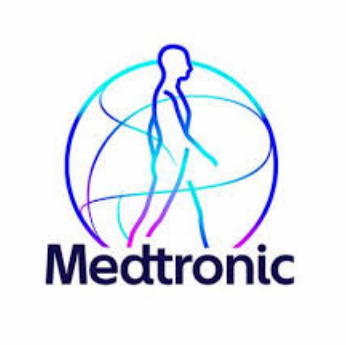
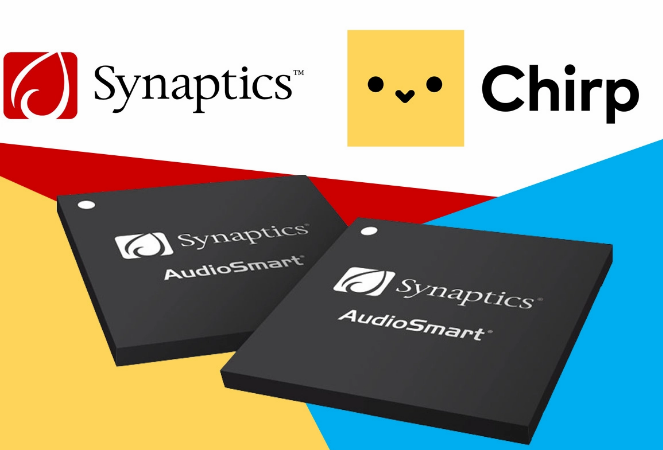
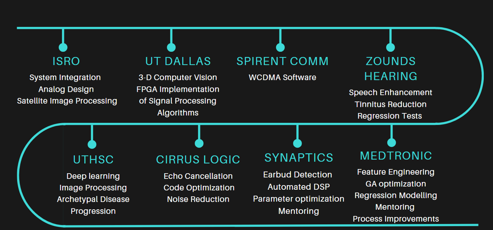

# Portfolio
Portfolio for my profile
# About Me
Hi all, I go by Sid.
- 🚀 Innovation @ AI, Computer Vision, Data Science, and Signal Processing  
- 🚀 Solving complex healthcare and tech challenges  
- 🚀 Proven leader delivering impactful solutions and mentoring teams to success

# Resume Link
[Download My Resume](https://drive.google.com/file/d/1WME7KWji7VekexhDrhlTokt-UJ9XAbfn/view?usp=drive_link)
# Awards
Book Author

## Skills
*Jack of all trades, Master of some*
- ⚡ **Develop cutting-edge Computer Vision and Machine Learning solutions** tailored for businesses, focusing on real-world applications such as predictive analytics, automation, and customer insights.
- ✍️ **Write compelling articles and technical blogs on AI, technology trends, and innovation** to educate and inspire audiences.
- 🎨 **Design intuitive visualizations/dashboards** that merge functionality with aesthetics, ensuring seamless user experiences.
- 🚀 **Lead cross-functional teams to deliver impactful projects on time and within scope.**
- 🚀 **Mentor/Coach to navigate the difficult job market and more.**

## Software Skills

- **Programming Languages**
  - C/C++
  - Python
  - Matlab
  - SQL

- **Machine Learning Frameworks**
  - Keras
  - TensorFlow
  - PyTorch

- **Cloud Platforms**
  - GCP (Google Cloud Platform)
  - AWS (Amazon Web Services)
    
#Work Projects
Computer vision/Image Processing/ML
   = Image classification

## Notable Projects

*Notable companies that I helped to build innovative technology foundations from concept.*

### Medtronic  
  
**Description:** Automated feature normalization, slashing manual optimization from 3 days to hours via custom pipeline implementation.  
[Visit Website](https://www.medtronic.com/en-us/index.html)

---

### Indian Space Research Organization (ISRO)  
  
**Description:** Engineered MTF algorithm, blind deconvolution & wavelet denoising for high PSNR gain in Cartosat-2 satellite imagery.  
[Visit Website](https://www.isro.gov.in/)

---

### Synaptics Audio (Now Google)  
  
**Description:** Developed earbud in/out detection algorithm with hybrid ANC/ENC and AI/neural processing, boosting efficiency, cutting size/cost for enhanced audio.  
[Visit Website](https://www.synaptics.com/)

---

### Zounds Hearing  
  
**Description:** Spearheaded first patient-centric tinnitus diagnostic tool with GUI integration for hearing aid platforms.  
[Visit Website](https://www.zoundshearing.com/)
## Education

- **University of Texas at Dallas**  
   
  *Master of Science in Electrical Engineering*  
  **Duration:** September 2008 - May 2011  
  **Description:**  
  - Research on Signal Processing, Machine Learning, and Computer Vision
 
## Work Expereince TimeLine
       
## Blog 

### Social Media Links

  
  

 
